# Vue-Admin-For-Shop
基于[vue-admin-template](https://gitee.com/panjiachen/vue-admin-template)商城后台管理前端项目，开发阶段数据使用MockServer模拟，满足前后端分离开发

## 快速上手文档：

1. [vue-element-admin (gitee.io)](https://panjiachen.gitee.io/vue-element-admin-site/zh/)
2. [组件 | Element](https://element.eleme.cn/#/zh-CN/component/icon)
3. [Mock.js (mockjs.com)](http://mockjs.com/examples.html#Name)
4. [安装 — Vue.js (vuejs.org)](https://cn.vuejs.org/v2/guide/installation.html#直接用-lt-script-gt-引入)

## 开发路线：

1. V1.0 完成项目的全部功能
2. V2.0 封装增删改查统一api，提取工具函数（当前，受限于技术储备不足，跨域的问题只能封装api，还不能封装crud方法）
3. V3.0 封装前端页面模板根据tableDate快速生成前端页面

## 安装：

1. npm install
 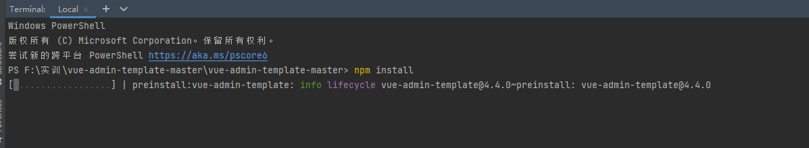

2. 报错跟着提示执行命令即可：
 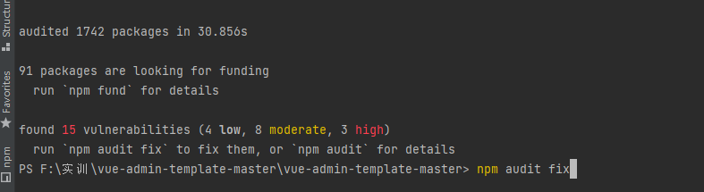

3. npm run dev   运行

    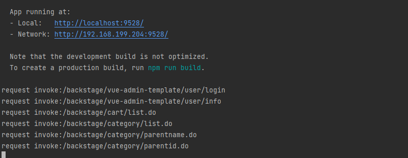

4. 点击即可预览项目

## 修改项目注意点：

1. 入手：

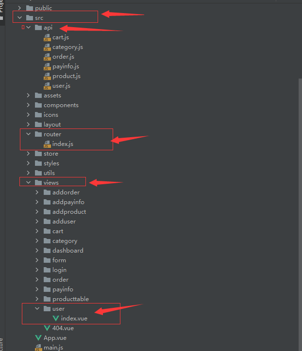

首先进入src文件夹，在views文件下创建对于组件的文件在该文件夹下创建index.vue文件，然后在router中注册组件这样在侧边栏就能看到组件了，最后在api文件夹下创建对于的api js文件

2. mock模拟数据：

   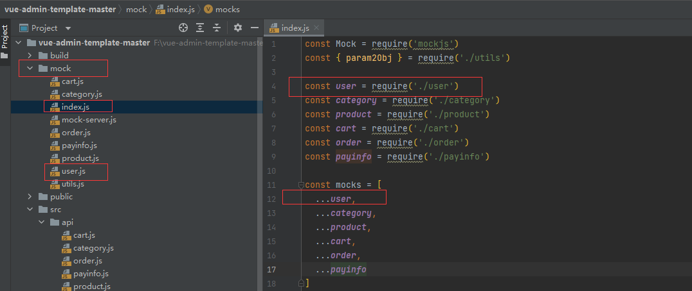

   mock文件下创建对应js文件，在index中注册url，这样mockserver就能拦截全部对应的url了。

   mock模拟数据：

   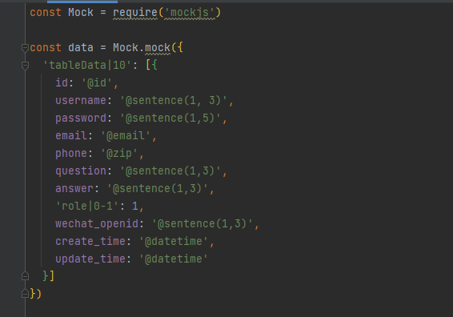

   数据导出：

   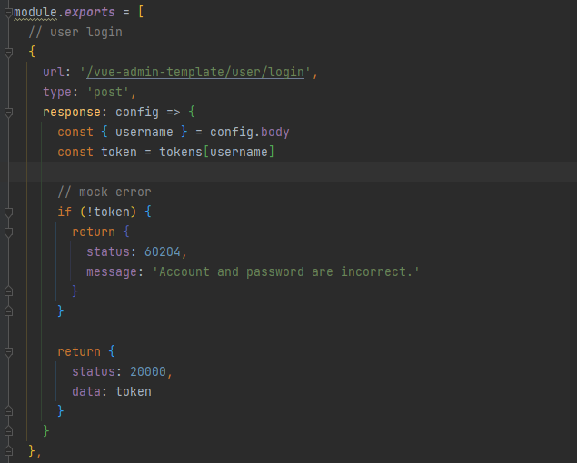

   3. 配置baseURL
   
   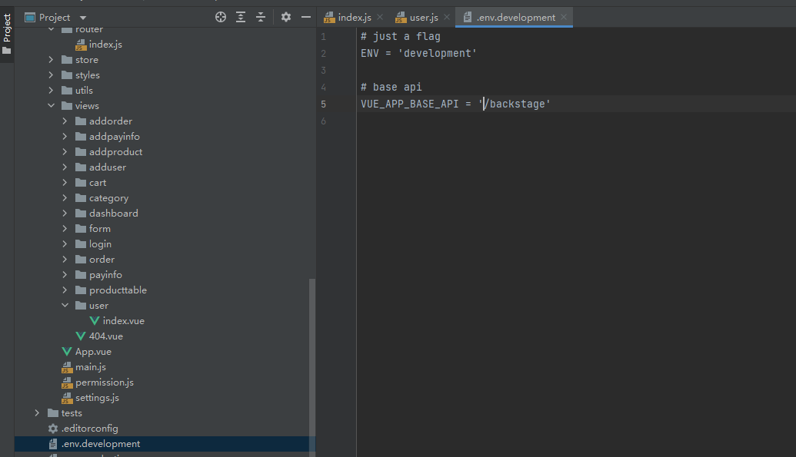
   
   4. 使用apifox 或者postman 测试接口 get方法header中需要带上一下几个参数
   
   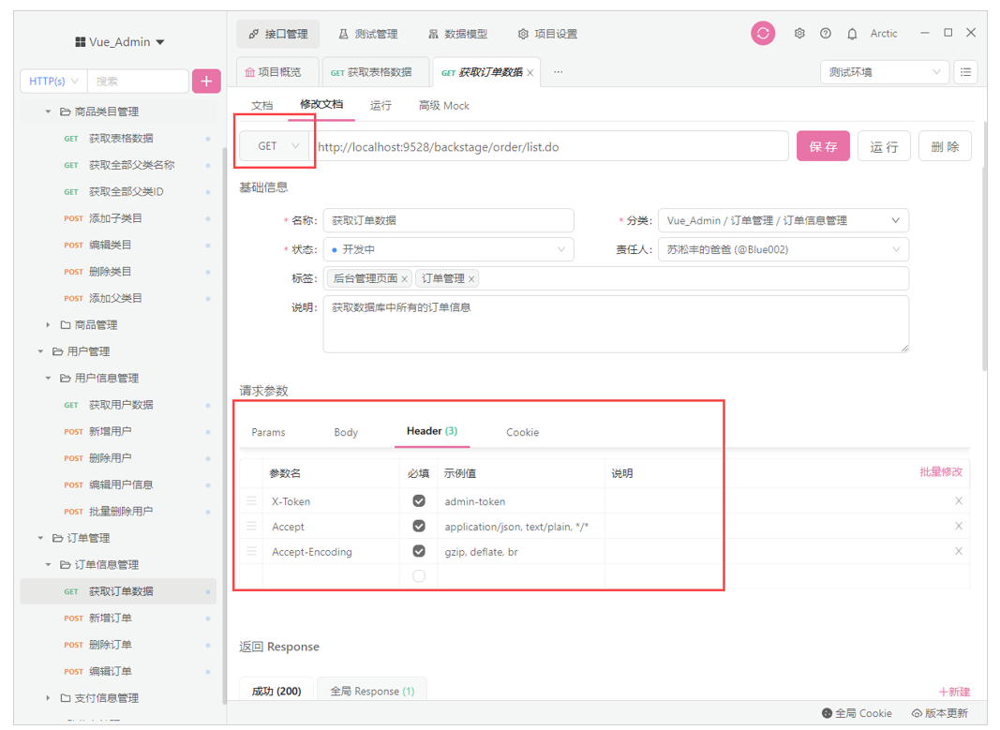
   
     
   
## 前后端联调 前端页面设置 后端跨域设置

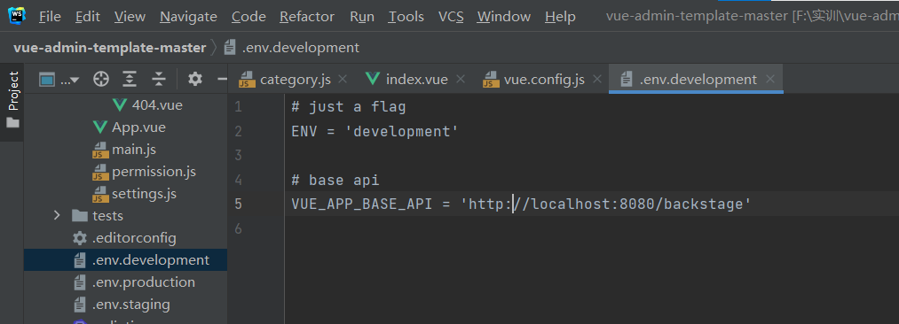

根目录下找到.env.development文件中修改BASE_API

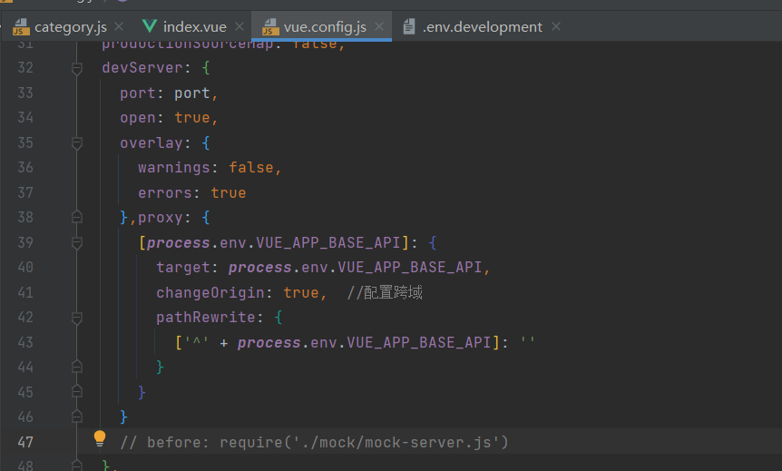

根目录下找到vue.config.js配置proxy（紧跟overlay），将 **before: require('./mock/mock-server.js')**注解

```javascript
proxy: {
      [process.env.VUE_APP_BASE_API]: {
        target: process.env.VUE_APP_BASE_API,
        changeOrigin: true,  //配置跨域
        pathRewrite: {
          ['^' + process.env.VUE_APP_BASE_API]: ''
        }
      }
```

**后端跨域：**

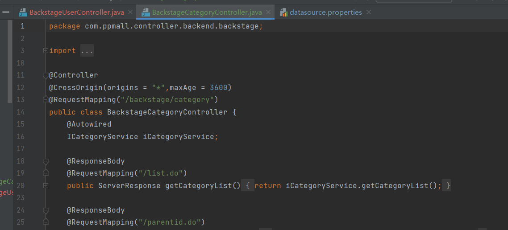

在对应的Controller加上注解

```java
@CrossOrigin(origins = "*",maxAge = 3600)
```

## 预览：


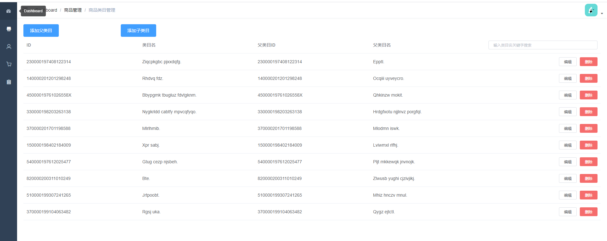

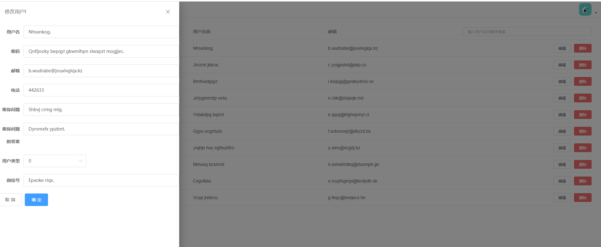

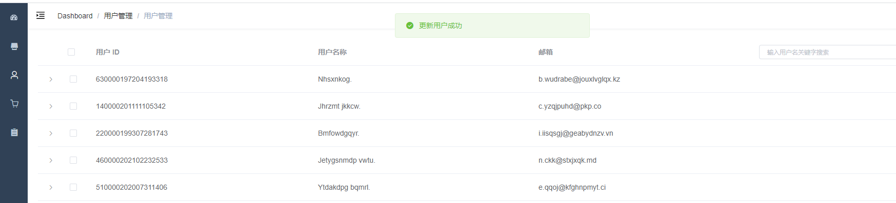
